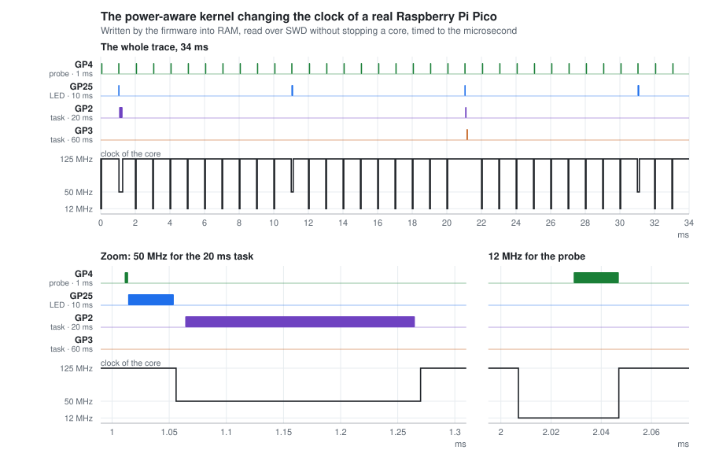
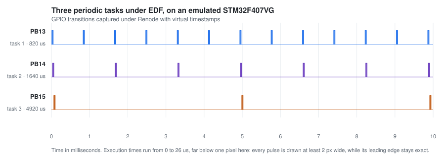

<p align="center">
  <picture>
    <source media="(prefers-color-scheme: dark)" srcset="docs/images/banner-dark.svg">
    
  </picture>
</p>

<p align="center">
  <a href="https://github.com/beber007/escapement/actions/workflows/build.yml"></a>
  
  
  
  
  
  <a href="LICENSE"></a>
</p>

**A preemptive deadline-driven real-time kernel for microcontrollers with a few
kilobytes of RAM.**

Escapement schedules by earliest deadline first (EDF) or by deadline-monotonic
priorities (DM), and has **no periodic tick**: it arms a comparator on the next
deadline and wakes the processor for that instant alone. Its *power-aware*
variant lowers the core voltage and frequency according to the actual load, using
the worst-case execution times declared by the tasks — without ever missing a
deadline.

> The name comes from the watchmaking escapement: the part that releases the
> energy of the mainspring in regular increments, as the scheduler releases the
> processor to its tasks.

## In three figures

| | |
|---|---|
| **5,164 bytes** | the whole kernel and four periodic tasks, on a Cortex-M0+ |
| **3.2 µs** | cost of one scheduling round of the hard kernel, measured on the board — 0.33 % of the processor at 1,000 activations per second, under EDF as under DM: see [`docs/rp2040.md`](docs/rp2040.md) |
| **+28 ppm** | deviation of the periods read by an external frequency counter: the tolerance of the crystal on the board, not that of the scheduler |

## On the silicon



A Raspberry Pi Pico running the power-aware kernel: 50 MHz is enough for the 20 ms
task to meet its deadline, 12 MHz for the 1 ms probe, and the rest runs at 125 MHz.
The firmware writes the trace into RAM and the debugger reads it without stopping a
core; `tools/dvfs_figure.py` draws it from [the data](docs/data/pico-pa-trace.csv).
The trace also shows what is left to settle: the idle task sleeps at 125 MHz, which
only a current measurement will price — see [`docs/rp2040.md`](docs/rp2040.md).

## Verified at six levels

Each level is independent of the ones before it, and they answer different
questions: the instrument says the periods are right, the host test says the
scheduler decided what it was supposed to decide.

| Level | Means | What it establishes |
|---|---|---|
| Compilation | GitHub Actions, with a toolchain other than the developer's | the examples of the Pico, the Pico 2 and the STM32F4, on every push |
| The scheduler alone | the kernel built for the host, with time as a variable and AddressSanitizer watching memory | the hard, the soft and the power-aware kernel, each under EDF and DM scheduling: ten tasks over 200,000 ticks with every activation on time, tasks released together run in priority order, three wraps of the kernel clock, event-driven tasks, the FIFO queue and the slot buffers, (m,k)-firm tasks under overload, and the speeds the power-aware kernel asks for — 87 to 90 % of the lines of each kernel |
| Every interleaving | small models explored exhaustively in CI (`test/model`) | the 3- and 4-slot buffers and the FIFO queue, preempted at every access, both slot buffers on two cores too, each core free to reorder its accesses as the architecture allows: no read mixes two records or goes backwards, every run of the queue is linearizable — with the faulty variants each model must catch |
| Replayable execution | Renode and `renode-test` | tasks scheduled at their periods, the UART echo answering, event-driven tasks woken on time by a timer-event handler, and the 2^30 wrap of the kernel clock crossed, on the STM32F4, the RP2040 and the RP2350; on the RP2040 as well, the DVFS driver raising the voltage before the frequency and lowering it after, and on the RP2350 the 4-slot buffer between its two cores — all as regression tests |
| Internal state on hardware | OpenOCD and SWD on a Pico | a trace of the scheduling read without stopping a core: deadlines armed ahead of the counter, timer events delivered on the microsecond, the clock changed by the power-aware kernel; cost counters read back from SRAM |
| Independent instrument | frequency counter of a Bus Pirate v4 | periods measured outside the kernel, outside the emulator and outside the debugger |

That last level reads 500.02 Hz, 50.0014 Hz and 16.66713 Hz for declared periods
of 1, 20 and 60 ms, and 100.0031 Hz for the 10 ms output of the timer events under
each of the three kernels. Details in [`docs/rp2040.md`](docs/rp2040.md).

The host test, when it came, found that the levels before it had all been green on a
kernel that was not running the algorithm this page advertises. The models, added
after, found three defects every other level had passed: a 3-slot reader that could
read past its array when an interrupt came at the wrong instruction, an event queue
whose signal could wake two tasks, and, once a model covered two cores, a 3-slot
writer that could hand the reader the very slot it was writing. Once each core was
allowed to reorder its accesses, the models showed that neither slot buffer was safe
between two cores without memory barriers, which the kernels lacked. Those stories are in
[`docs/method.md`](docs/method.md).



Every edge above was captured under emulation, with the virtual timestamps of the
emulator, and the figure is regenerated from that data by a script in `tools/`
— see [`docs/emulation.md`](docs/emulation.md).

## Watch it run

The scheduler alone, on the machine you are reading this on, in one command:

```sh
make -C test/host run
```

The whole kernel under emulation, without any hardware, using
[Renode](https://renode.io):

```sh
cd Escapement/CORTEX-Mx/STM32/Examples/stm32f4-discovery && make bin && cd -
renode emulation/renode/escapement_f4.resc
```

On a Raspberry Pi Pico, loaded into SRAM over SWD — no BOOTSEL button involved:

```sh
cd Escapement/CORTEX-Mx/RP2040/Examples/pico && make
openocd -f interface/cmsis-dap.cfg -c 'adapter speed 5000' -f target/rp2040.cfg \
        -c 'init; reset halt; load_image build/TaskLEDPico.elf; resume 0x20000000; exit'
```

## What sets this kernel apart

### Scheduling

**EDF without a tick.** Mainstream real-time kernels schedule at fixed
priorities, paced by a periodic tick. Here tasks declare a period and a deadline,
the scheduler elects the one whose deadline is nearest, and the hardware
interrupts the processor at that moment only. DM scheduling is available too,
selected in the configuration of an application.

**Overload that degrades by design.** A second kernel schedules (m,k)-firm tasks:
out of every k instances of a task, m are guaranteed, and the others run only if a
test on the declared execution times shows they will finish in time — so an overload
drops chosen instances instead of missing arbitrary deadlines.

**Energy management driven by the scheduler.** Tasks declare their worst-case
execution time; the kernel uses it to know *by how much* it may slow the core
down without endangering a deadline — which is what the DRA, OTE and DM_SLACK
algorithms compute. The power-aware kernel schedules by EDF\*, an EDF whose ties
are broken deterministically, so that it can forecast when each task will end.
Whether that lever actually saves energy is examined in
[`docs/power-aware.md`](docs/power-aware.md), and not settled yet.

**A time base independent of the core, on the RP2040.** Its counter is fed by a
one-microsecond tick derived from the reference clock: changing the processor
frequency does not move the time base of the kernel, which makes this chip a
good target for the power-aware variant.

### Concurrency without locks

**A kernel that takes no lock.** None of the three kernels masks interrupts to protect
its queues: they are updated with load-linked / store-conditional pairs, `LDREX`/`STREX`
on the Cortex-M3, M4 and M33. The Cortex-M0+ has no such instructions; there the
reservation is a flag that every context switch and every interrupt clears on its way
out, and only the store-conditional runs with interrupts masked, for a few instructions.
No task ever waits for another, so no priority inversion can arise inside the kernel.
The emulated reservation holds on one core only: on the RP2040 the kernel runs on core 0
alone. The RP2040 port itself masks interrupts in a few short places — a change of
speed, the list of pending timer events, the trace.

**FIFO queues shared with interrupt handlers.** `OSInitFIFOQueue` gives any number
of producers and consumers, interrupt handlers included, a queue whose buffers are
allocated once, when it is created. It is an array-based queue built on the
load-linked / store-conditional algorithm of Evéquoz [1], to which the kernel adds
one announced operation that any preempting caller completes first: on a single
core, every operation finishes in a bounded number of steps. The same queue holds
the tasks waiting for an event, and a marker left in it by a signal that found no
task waiting keeps the wake-up from being lost.

**Reader and writer that never wait for each other.** `OSInitBuffer` hands the
latest complete data from one writer — typically a sensor interrupt — to one
reader, neither ever blocking the other: with four slots after Simpson [2],
without any atomic instruction, or with three slots after Chen and Burns [3],
using less memory and a load-linked / store-conditional pair. The four slots also
cross between the two cores of the Pico, as Simpson meant them to: 320,000 reads by a
task on core 0 of what bare code on core 1 wrote, none torn, where a plain array
tore one in twenty ([`docs/rp2040.md`](docs/rp2040.md)). Those runs predate the
memory barriers the weak-memory models call for, added on 2026-09-25.

**Checked over every interleaving.** Each of the three has a model in
[`test/model`](test/model), explored exhaustively in CI: the reader and the writer
of the slot buffers, the operations of the queue preempting one another at every
access, the load-linked / store-conditional pair as the Cortex-M0+ emulates it.
They found four defects, now fixed: the 3-slot reader had not allowed for a
store-conditional failing, as it does, unlike a compare-and-swap, whenever an
interrupt merely came between it and its load-linked; a queue of event-driven
tasks could let one signal wake two of them; the 3-slot writer tried its
store-conditional once too — harmless on one core, where the interrupt that makes
it fail clears the reader's reservation as well, not between two cores, where the
reader's survives; and between two cores both slot buffers lacked the memory
barriers that keep each core's accesses in order. None lies in the published
algorithms: the first and the third came from carrying a compare-and-swap over to a
store-conditional tried once, a pitfall the literature knows, the second from the
signal and the announced operation that ZottaOS added to Evéquoz's queue, the
fourth from code written for one core.

**References**

1. C. Evéquoz, [*Non-Blocking Concurrent FIFO Queues with Single Word
   Synchronization Primitives*](https://doi.org/10.1109/ICPP.2008.82), 37th
   International Conference on Parallel Processing (ICPP), 2008, pp. 397–405.
   The author worked at the HEIG-VD, where the kernel that Escapement continues was
   developed.
2. H. R. Simpson, [*Four-slot fully asynchronous communication
   mechanism*](https://doi.org/10.1049/ip-e.1990.0002), IEE Proceedings E, 137(1),
   1990, pp. 17–30. J. Rushby [model-checked
   it](http://www.cs.ox.ac.uk/ucs/rushbysimpson.pdf) (SRI, 2002): correct
   provided its control variables are atomic, which single bytes are on a
   Cortex-M.
3. J. Chen and A. Burns, [*A three-slot asynchronous reader/writer mechanism for
   multiprocessor real-time
   systems*](https://www.semanticscholar.org/paper/9329db8087ba6a3eb87ac9dc2ba75ff74ddb3076),
   Technical Report YCS-286, University of York, 1997.

## How this project is built

This project is developed with the help of an AI, under one standing rule:
**the AI proposes, the instrument decides.** The six levels of verification
above exist for that reason.

The documentation therefore keeps a record of the hypotheses that turned out to
be wrong, rather than showing only the outcome: an emulator model accused
without evidence before a two-register reproducer settled the matter, a hardware
cause wrongly dismissed because the binary under test was stale, an instrument
wrongly suspected when the defect was in the firmware. The full account is in
[`docs/method.md`](docs/method.md).

## Documentation

| | |
|---|---|
| [`docs/architecture.md`](docs/architecture.md) | kernel variants, targets, source tree |
| [`docs/build.md`](docs/build.md) | toolchain, examples, memory footprint |
| [`docs/api.md`](docs/api.md) | writing an application: tasks, events, queues and buffers, interrupts |
| [`docs/emulation.md`](docs/emulation.md) | Renode, tests replayed in CI, fixes to the timer model |
| [`docs/power-aware.md`](docs/power-aware.md) | DVFS, energy analysis, choosing a target |
| [`docs/rp2040.md`](docs/rp2040.md) | Raspberry Pi Pico port and hardware measurements |
| [`emulation/renode/RP2040.md`](emulation/renode/RP2040.md) | emulating the Pico under Renode |
| [`docs/method.md`](docs/method.md) | verifying AI-assisted development |
| [`test/host`](test/host) | the scheduler built for the machine it runs on |
| [`docs/roadmap.md`](docs/roadmap.md) | current state and open work |

## Origin and licence

Escapement continues **ZottaOS**, a real-time kernel developed at HEIG-VD whose
development stopped in 2016. The code has been rebranded and taken over as a
personal project; `LICENSE` and `NOTICE` keep the original copyright and set out
the lineage as well as the third-party components.
