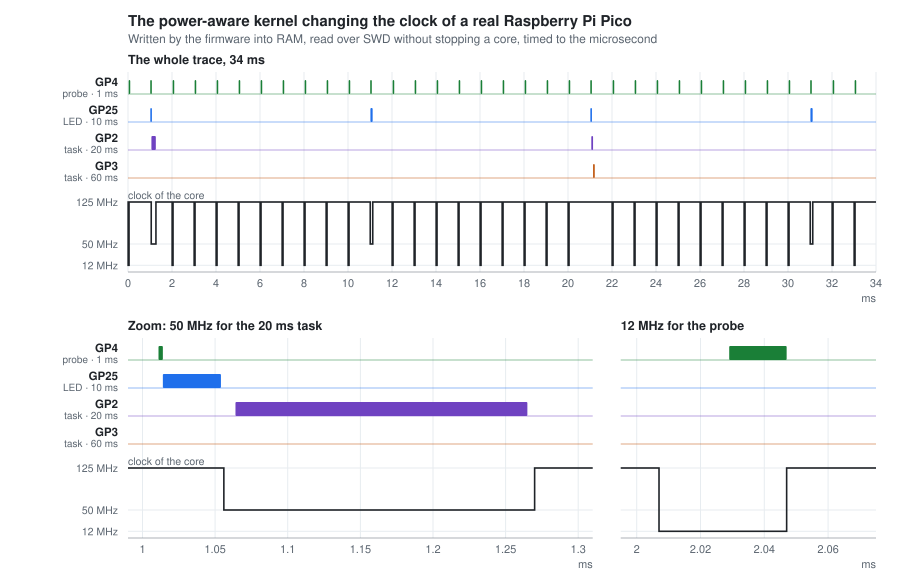

<p align="center">
  <picture>
    <source media="(prefers-color-scheme: dark)" srcset="docs/images/banner-dark.svg">
    
  </picture>
</p>

<p align="center">
  <a href="https://github.com/beber007/escapement/actions/workflows/build.yml"></a>
  
  
  
  
  
  <a href="LICENSE"></a>
</p>

<p align="center">
  <a href="docs/architecture.md">Architecture</a> ·
  <a href="docs/method.md">Method</a> ·
  <a href="docs/api.md">API</a> ·
  <a href="docs/rp2040.md">Pico</a> ·
  <a href="docs/stm32u5.md">STM32U5</a> ·
  <a href="tools/board_ci.md">Board checks</a> ·
  <a href="docs/roadmap.md">Roadmap</a>
</p>

**A preemptive deadline-driven real-time kernel for microcontrollers with a few
kilobytes of RAM.**

Escapement schedules tasks by earliest deadline first (EDF) or by deadline-monotonic
priorities (DM). It has no periodic tick. The timer is set for the next release of a
task, and the processor sleeps until then. The power-aware variant also lowers the
core voltage and frequency. It uses the worst-case execution times the tasks declare,
and slows down only as far as those times still meet every deadline.

> The name comes from the watchmaking escapement: the part that releases the
> energy of the mainspring in regular increments, as the scheduler releases the
> processor to its tasks.

## What it shows

- EDF and DM scheduling without a periodic tick. The cost of a scheduling round is
  measured on the board ([`docs/rp2040.md`](docs/rp2040.md)).
- A kernel whose queues take no lock, even on the Cortex-M0+, which has no
  load-linked/store-conditional instructions ([Design](#concurrency-without-locks)).
- Lock-free buffers and queues checked over every interleaving by small exhaustive
  models, weak memory ordering included. Each model must also catch deliberately broken
  variants. One of them cut the memory barriers of a queue between two cores from
  fifteen to six ([`docs/method.md`](docs/method.md)).
- Voltage and frequency chosen from the declared execution times, traced on real
  silicon ([below](#on-the-silicon), [`docs/power-aware.md`](docs/power-aware.md)).
- An idle task that puts an STM32U5 into Stop 2 and still keeps the kernel's time to
  the microsecond ([`docs/stm32u5.md`](docs/stm32u5.md)).
- Two boards tested on every commit by a bench that pulls `main` by itself
  ([`tools/board_ci.md`](tools/board_ci.md)).

## In four figures

| | |
|---|---|
| **4,716 bytes** | of code for the whole kernel plus four periodic tasks, on a Cortex-M0+, with GCC 16.2 on 2026-09-27. It was 5,164 on 2026-09-25, and the kernel has shrunk since ([`docs/build.md`](docs/build.md)) |
| **3.2 µs** | one scheduling round of the hard kernel, measured on the board on 2026-09-23. At 1,000 activations per second that is 0.33 % of the processor, under EDF and DM alike. The bench on the UNO Q has read 3.5 µs since 2026-09-26 ([`docs/rp2040.md`](docs/rp2040.md)) |
| **+28 ppm** | how far the periods are off when read by an external frequency counter. That is the tolerance of the board's crystal, not an error of the scheduler |
| **108,000** | task activations in three hours on an STM32U5. Between them the idle task slept in Stop 2 454,487 times, with the kernel's clock stopped. None started a microsecond off its period ([`docs/stm32u5.md`](docs/stm32u5.md)) |

## Where it runs

| Board | Core | Kernels | Run on |
|---|---|---|---|
| Raspberry Pi Pico (RP2040) | Cortex-M0+, 125 MHz | hard, soft, power-aware with DVFS | the board, checked at each commit; Renode |
| Arduino UNO Q (STM32U585) | Cortex-M33, 160 MHz | hard, soft; the idle task in Stop 2 | the board, checked at each commit; Renode |
| Raspberry Pi Pico 2 (RP2350) | Cortex-M33, 150 MHz | hard, soft; two cores sharing lock-free buffers | Renode; on the board since 2026-09-28, its clocks and the five examples that count in memory |
| NUCLEO-U575ZI-Q (STM32U575) | Cortex-M33, 160 MHz | the hard kernel's example in Stop 2, for current measurement; the endurance test | the endurance test on the board since 2026-09-28; Renode |

## An application

Each task gives its period and its deadline in microseconds. Here is a whole program
for the Pico, using the hard kernel ([`docs/api.md`](docs/api.md)):

```c
#include "Escapement.h"

static void Blink(void *argument);

int main(void)
{
  extern void (* const CortexMxVectorTable[])(void);
  VTOR = (UINT32)CortexMxVectorTable;   /* the image runs from SRAM */
  OSInitializeSystemClocks();           /* crystal, PLL, 125 MHz */
  OSCreateTask(Blink,0,500000,500000,NULL);   /* every 0.5 s, due within it */
  return OSStartMultitasking(NULL,NULL);
}

static void Blink(void *argument)
{
  SIO_GPIO_OUT_XOR = 1u << 25;          /* the LED of the Pico */
  OSEndTask();
}
```

`VTOR` and `SIO_GPIO_OUT_XOR` are register addresses the application defines itself.

## On the silicon



A Raspberry Pi Pico running the power-aware kernel. The 20 ms task meets its deadline
at 50 MHz and the 1 ms probe at 12 MHz, so that is how fast they run. Everything else
runs at 125 MHz. The firmware writes the trace into RAM, and the debugger reads it
without stopping a core. `tools/dvfs_figure.py` draws the figure from
[the data](docs/data/pico-pa-trace.csv). One question is left open: the idle task
sleeps at 125 MHz, and only a current measurement can say what that costs
([`docs/rp2040.md`](docs/rp2040.md)).


The same board under the hard kernel, at an instant when its four tasks are released
together. Above, the schedule computed from the task set and the kernel's costs the
trace shows. Below, the trace. They agree within 2 µs. Every response the trace saw stays
under the bound of the analysis in ZottaOS's manual, 526 µs at most against 620
([`docs/rp2040.md`](docs/rp2040.md#response-times-against-their-analysis)).

## Verified at six levels

The levels answer different questions. The frequency counter says the periods are
right. The host test says the scheduler made the decisions it should have.

| Level | What it establishes |
|---|---|
| Compilation | every example of the three ports built by two compilers at each push to `main` |
| The scheduler alone | every kernel and algorithm run on the host under AddressSanitizer, 87 to 90 % of each kernel's lines |
| Every interleaving | the lock-free buffers and queues explored exhaustively, weak memory included |
| Replayable execution | the three ports under Renode, as regression tests |
| Internal state on hardware | the scheduling traced on a running board, and two boards checked at each commit |
| Independent instrument | the periods read by a frequency counter, outside all the project's software |

<details>
<summary>What each level covers</summary>

| Level | Means | What it establishes |
|---|---|---|
| Compilation | GitHub Actions, with the developer's GCC and a second one, 14.2 | the examples of the Pico, the Pico 2 and the STM32U5, on each push to `main` and each pull request |
| The scheduler alone | the kernel built for the host, with time as a variable and AddressSanitizer watching memory | the hard, the soft and the power-aware kernel, each under EDF and DM scheduling: ten tasks over 200,000 ticks with every activation on time, tasks released together run in priority order, three wraps of the kernel clock, event-driven tasks, the FIFO queue and the slot buffers, (m,k)-firm tasks under overload, and the speeds the power-aware kernel asks for — 87 to 90 % of the lines of each kernel |
| Every interleaving | small models explored exhaustively in CI (`test/model`) | the 3- and 4-slot buffers and the FIFO queue, preempted at every access, both slot buffers on two cores too, each core free to reorder its accesses as the architecture allows, and the queue of Evéquoz between the cores of the RP2350: no read mixes two records or goes backwards, every run of the queue is linearizable — with the faulty variants each model must catch |
| Replayable execution | Renode and `renode-test` | tasks scheduled at their periods, the UART echo answering, event-driven tasks woken on time by a timer-event handler, and the 2^30 wrap of the kernel clock crossed, on the RP2040, the RP2350 and the STM32U5; on the RP2040 as well, the DVFS driver raising the voltage before the frequency and lowering it after, on the RP2350 both slot buffers between its two cores, and on the STM32U5 the idle task sleeping on its low-power timer and moving the kernel clock on, across the 2^30 wrap too — all as regression tests |
| Internal state on hardware | OpenOCD and SWD on a Pico; the reports of an STM32U5 to the Linux of its Arduino UNO Q | a trace of the scheduling read without stopping a core: deadlines armed ahead of the counter, timer events delivered on the microsecond, the clock changed by the power-aware kernel; cost counters read back from SRAM; on the U5, an endurance test run for hours with every part checked each second, its causes of reset, and its clock measured against Linux's within some 25 ppm; at each commit, the idle task in Stop 2, every task starting on its period and every timer event and byte from Linux coming through it |
| Independent instrument | frequency counter of a Bus Pirate v4 | periods measured outside the kernel, outside the emulator and outside the debugger |

</details>

Read by that counter, the declared periods of 1, 20 and 60 ms give 500.02 Hz,
50.0014 Hz and 16.66713 Hz. The 10 ms output of the timer events reads 100.0031 Hz
under each of the three kernels ([`docs/rp2040.md`](docs/rp2040.md)).

Levels have caught what the earlier ones missed. The host test found the kernel
scheduling by DM while this page said EDF. The models found four bugs in the
lock-free code that every test had let through. The stories are in
[`docs/method.md`](docs/method.md).

## Watch it run

The scheduler on its own, on your machine:

```sh
make -C test/host run
```

The whole kernel in the [Renode](https://renode.io) emulator, no hardware needed:

```sh
make -C Escapement/CORTEX-Mx/RP2350/Examples/pico2
renode-test emulation/renode/escapement_pico2.robot
```

On a Raspberry Pi Pico, loaded into SRAM over SWD (no BOOTSEL button):

```sh
cd Escapement/CORTEX-Mx/RP2040/Examples/pico && make
openocd -f interface/cmsis-dap.cfg -c 'adapter speed 5000' -f target/rp2040.cfg \
        -c 'init; reset halt; load_image build/TaskLEDPico.elf; resume 0x20000000; exit'
```

On the STM32U585 of an Arduino UNO Q. The board's own Linux loads the image into SRAM
over SSH, and Arduino's firmware stays in the flash:

```sh
make -C Escapement/CORTEX-Mx/STM32U5/Examples/uno-q
tools/unoq_load.sh Escapement/CORTEX-Mx/STM32U5/Examples/uno-q/build/TaskLEDU5.elf
```

## Design

### Scheduling

<details>
<summary>EDF without a tick</summary>

FreeRTOS, for example, uses fixed priorities and a periodic tick, which its tickless
mode only suspends while the processor is idle. Here each task declares a period and a
deadline. The scheduler runs the task whose deadline is
nearest, and the timer only interrupts the processor when a task is released. DM
scheduling is also available, chosen in the application's configuration.

</details>

<details>
<summary>Overload that degrades by design</summary>

A second kernel schedules (m,k)-firm tasks. Out of every k instances of a task, m are
guaranteed. The others run only if a test on the declared execution times shows they
will finish in time. Under overload the kernel drops instances it has chosen, rather
than missing deadlines at random.

</details>

<details>
<summary>Energy management driven by the scheduler</summary>

Tasks declare their worst-case execution time. The kernel uses it to work out how much
it can slow the core down without putting a deadline at risk, which is what the DRA,
OTE and DM_SLACK algorithms compute. The power-aware kernel schedules by EDF\*, an EDF
that breaks ties in a fixed way, so it can predict when each task will finish. Whether
this actually saves energy is not settled yet
([`docs/power-aware.md`](docs/power-aware.md)).

</details>

<details>
<summary>A time base independent of the core, on the RP2040</summary>

The kernel's counter runs on a one-microsecond tick taken from the reference clock.
Changing the processor frequency does not move it, which the power-aware kernel
depends on.

</details>

<details>
<summary>An idle task in Stop 2, on the STM32U5</summary>

The other ports sleep between tasks with their clocks running. On the U5, if the
application asks for it, the idle task stops them. When the next event is at least
5 ms away, it sets a low-power timer on the 32.768 kHz crystal to wake 3 ms early and
enters Stop 2. The kernel's timer stops too. On waking, the idle task restarts the
clocks and moves the kernel's timer forward by what the low-power timer counted. The
UART to the board's Linux keeps receiving. On the board, every task still starts on
time to the microsecond and no wake-up has been late
([`docs/stm32u5.md`](docs/stm32u5.md)). How much current it saves has not been
measured yet.

</details>

### Concurrency without locks

<details>
<summary>A kernel that takes no lock</summary>

None of the three kernels masks interrupts to protect its queues. They use
load-linked/store-conditional pairs instead, `LDREX`/`STREX` on the Cortex-M33. The
Cortex-M0+ has no such instructions. There the reservation is a flag that every
context switch and every interrupt clears on the way out, and only the
store-conditional itself runs with interrupts masked, for a few instructions. No task
ever waits for another, so priority inversion cannot happen inside the kernel. The
emulated reservation only works on one core, so on the RP2040 the kernel runs on core 0
alone. The RP2040 port does mask interrupts in a few short places: a change of speed,
the list of pending timer events, and the trace.

</details>

<details>
<summary>FIFO queues shared with interrupt handlers</summary>

`OSInitFIFOQueue` creates a queue for any number of producers and consumers, interrupt
handlers included. Its buffers are allocated once, when the queue is created. It is an
array-based queue built on Evéquoz's load-linked/store-conditional algorithm [1]. The
kernel adds one announced operation, which any preempting caller finishes first, so on
a single core every operation completes in a bounded number of steps. The same queue
holds the tasks waiting for an event. A signal that finds no task waiting leaves a
marker in it, so the wake-up is not lost.

</details>

<details>
<summary>A reader and a writer that never wait for each other</summary>

`OSInitBuffer` passes the latest complete data from one writer, typically a sensor
interrupt, to one reader. Neither ever blocks the other. There are two versions: four
slots after Simpson [2], with no atomic instruction at all, and three slots after Chen
and Burns [3], which use less memory and one load-linked/store-conditional pair. The
four-slot version also works between the two cores of the Pico, as Simpson intended. A
task on core 0 read 320,000 records written by bare code on core 1 and found none torn,
where a plain array tore about one in twenty ([`docs/rp2040.md`](docs/rp2040.md)).
Those runs predate the memory barriers the weak-memory models called for, added on
2026-09-25.

</details>

<details>
<summary>A queue between the cores of the Pico 2</summary>

The kernel's queue relies on preemptions being nested, which two cores do not provide.
For the RP2350, `OSInitCoreQueue` provides the queue from Evéquoz's paper [1] as
published: lock-free, for any number of producers and consumers on either core. The
paper assumes an ideal LL/SC, where an SC only fails if another thread got there first,
and warns that real hardware gives less. The project's model showed an index left
behind on a chip whose SC can also fail for no reason, so the queue retries that SC
([`docs/method.md`](docs/method.md)).

</details>

<details>
<summary>Checked over every interleaving</summary>

Each of the three has a model in [`test/model`](test/model), explored exhaustively in
CI. The models cover the reader and writer of the slot buffers, the queue operations
preempting each other at every access, and the load-linked/store-conditional pair as
the Cortex-M0+ emulates it. They found four bugs, all fixed: a 3-slot reader that could
read past its array, a signal that could wake two tasks, and, between two cores, a
3-slot writer that could hand the reader the slot it was still writing, and both slot
buffers without the memory barriers that keep each core's accesses in order. None of
them was in the published algorithms. They came from turning a compare-and-swap into a
single store-conditional attempt, from what ZottaOS added to Evéquoz's queue, and from
code written for one core ([`docs/method.md`](docs/method.md)).

</details>

**References**

1. C. Evéquoz, [*Non-Blocking Concurrent FIFO Queues with Single Word
   Synchronization Primitives*](https://doi.org/10.1109/ICPP.2008.82), 37th
   International Conference on Parallel Processing (ICPP), 2008, pp. 397–405.
   The author worked at the HEIG-VD, where the kernel that Escapement continues was
   developed.
2. H. R. Simpson, [*Four-slot fully asynchronous communication
   mechanism*](https://doi.org/10.1049/ip-e.1990.0002), IEE Proceedings E, 137(1),
   1990, pp. 17–30. J. Rushby [model-checked
   it](http://www.cs.ox.ac.uk/ucs/rushbysimpson.pdf) (SRI, 2002): correct
   provided its control variables are atomic, which single bytes are on a
   Cortex-M.
3. J. Chen and A. Burns, [*A three-slot asynchronous reader/writer mechanism for
   multiprocessor real-time
   systems*](https://www.semanticscholar.org/paper/9329db8087ba6a3eb87ac9dc2ba75ff74ddb3076),
   Technical Report YCS-286, University of York, 1997.


## How this project is built

This project is developed with the help of an AI. The rule is that the AI proposes and
the instrument decides, which is why there are six levels of verification.

The documentation therefore keeps the hypotheses that turned out wrong, not just the
results. An emulator model was blamed without evidence, until a two-register reproducer
settled the matter. A hardware cause was wrongly ruled out because the binary under
test was stale. An instrument was suspected when the bug was in the firmware. The full
account is in [`docs/method.md`](docs/method.md).

## Documentation

| | |
|---|---|
| [`docs/architecture.md`](docs/architecture.md) | kernel variants, targets, source tree |
| [`docs/build.md`](docs/build.md) | toolchain, examples, memory footprint |
| [`docs/api.md`](docs/api.md) | writing an application: tasks, events, queues and buffers, interrupts |
| [`docs/emulation.md`](docs/emulation.md) | Renode, tests replayed in CI, fixes to the timer model |
| [`docs/power-aware.md`](docs/power-aware.md) | DVFS, energy analysis, choosing a target |
| [`docs/rp2040.md`](docs/rp2040.md) | Raspberry Pi Pico port and hardware measurements |
| [`docs/stm32u5.md`](docs/stm32u5.md) | STM32U5 port on the Arduino UNO Q: clock, errata, endurance test, idle task in Stop 2 |
| [`tools/board_ci.md`](tools/board_ci.md) | the bench: the checks run on the boards at each commit |
| [`emulation/renode/RP2040.md`](emulation/renode/RP2040.md) | emulating the Pico under Renode |
| [`docs/method.md`](docs/method.md) | verifying AI-assisted development |
| [`test/host`](test/host) | the scheduler built for the machine it runs on |
| [`docs/roadmap.md`](docs/roadmap.md) | current state and open work |


## Origin and licence

Escapement continues ZottaOS, a real-time kernel that Claude Evéquoz and Bertrand Hurst
developed at the MIS institute of the HEIG-VD. Its code last changed in 2014, and it was
published on GitHub in 2016. Its sources and its user manual of May 2012 stay in the
archived repository [beber007/zottaos](https://github.com/beber007/zottaos). Escapement
takes the kernel up again as a personal project. `LICENSE` and `NOTICE` keep the
original copyright and describe the lineage and the third-party components.
