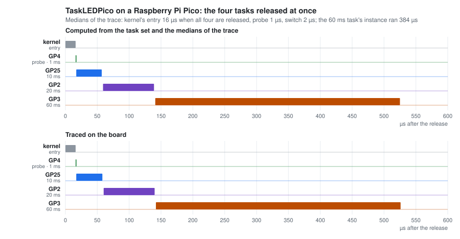

# The Raspberry Pi RP2040 port

**In short.** On a Pico, the hard, the soft and the power-aware kernels all run. The
power-aware one runs under its four policies, with the DVFS driver moving between 12,
50 and 125 MHz, and the timer events, the UART and the 4-slot buffer between the two
cores run as well. Measured on the board:

- a scheduling round costs 3.5 µs under the hard kernel, 0.35 % of the processor at one
  round a millisecond, read at each commit; 3.2 µs on 2026-09-23, before every firmware
  was built with `-fno-strict-aliasing`;
- the periods read +28 ppm on a frequency counter, as a Pico 2's do: the counter's
  reference, not the board ("The Pico 2 on the board");
- timer events are delivered on the microsecond;
- a change of speed takes 4 to 9 µs;
- the 4-slot buffer carried 326,525 reads between the cores without a torn one.

The current of this board has not been measured yet; it decides whether DVFS is worth
anything here (roadmap item 1). On the RP2350 it saves some 10 % at best (item 3). The
core undervolted under the kernel has run under emulation only.

The port lives in `Escapement/CORTEX-Mx/RP2040/`. With its headers and linker script it
came to **1,768** lines on 2026-10-05, counted below. The STM32 layer, removed on
2026-09-26, had 4,375, of which 1,757 went to its per-derivative vector tables; the
RP2040 is a single part with 26 interrupts.

| File | Role | Lines |
|---|---|---:|
| `Escapement_Timer.c` | the five functions the kernel expects, on TIMER | 308 |
| `Escapement_TimerEvent.c` | event manager on a free alarm, for event-driven tasks | 228 |
| `Escapement_UART.c` | PL011 driver, transmission through a queue of buffers | 249 |
| `Escapement_Processor.c` | clock tree: crystal, PLL, derived clocks; DVFS driver | 292 |
| `Escapement_Interrupts.c` | vector table and dispatch of the 26 IRQs | 102 |
| `Escapement_Core1.c` | launch of core 1 | 80 |
| `Escapement_SleepGate.c` | the idle task in SLEEP, clocks gated (`SLEEP_GATE`) | 66 |
| `RP2040_SRAM.ld` | linker script | 66 |
| `Escapement_RamEntry.S` | entry stub for a firmware loaded into SRAM | 33 |
| headers | | 344 |

## Two design choices

The firmware executes from SRAM. The RP2040 normally boots from an external QSPI flash,
which needs a 256-byte second-stage bootloader with its CRC. Linking into SRAM avoids
it, as the `no_flash` build type of the pico-sdk does, and keeps the flash out of the
power measurement the power-aware kernel will need. The image begins with a stub that
sets the stack pointer (`Escapement_RamEntry.S`). The vector table follows it, 256-byte
aligned (`RP2040_SRAM.ld`), and the application points `VTOR` at that table before it
enables interrupts.

Time is rebuilt modulo 2^30. The RP2040's counter is a free-running 64-bit one that
never wraps in practice, while Escapement expects a counter that wraps at 2^30 and
signals each wrap. `ALARM0` carries the deadline set by `_OSSetTimer`. `ALARM1`,
rearmed on each 2^30 boundary, stands in for the overflow interrupt.

The timer counts a 1 µs tick derived from `clk_ref`, not from `clk_sys`. Changing the
core frequency therefore leaves the kernel's time base where it was. On an STM32 the
timer clock follows the core clock, which makes DVFS harder.

## Execution on real hardware

The port first ran on a Raspberry Pi Pico W. It is loaded into SRAM over SWD through the
Raspberry Pi Debug Probe, with no BOOTSEL button to press:

```sh
openocd -f interface/cmsis-dap.cfg -c "$(tools/probe.sh)" -c 'adapter speed 5000' \
        -f target/rp2040.cfg \
        -c 'init; reset halt; load_image build/UARTEchoPico.elf; resume 0x20000000; exit'
```

`tools/probe.sh` selects the Debug Probe by its USB ids and serial, as every tool does
since 2026-09-25 (see “Cost of one scheduling round” for the reason).

`UARTEchoPico` sends back every byte it receives on UART0 (GP0 and GP1, 115200 baud):

```
sent b'escapement'  -> received b'escapement'   ECHO OK
sent b'RP2040 ok'   -> received b'RP2040 ok'    ECHO OK
sent b'0123456789'  -> received b'0123456789'   ECHO OK
```

`TaskLEDPico`, inspected over SWD while it ran, shows the scheduler arming its
deadlines in the future:

```
PC       = 0x20000864     the wfi of IdleTask
timer    advances by 136,241 µs between two reads
alarm0   armed 1,620 µs ahead of the counter
gpio_out = 0x8            GP3 high, a task was executing
```

> On a **Pico W**, the on-board LED is not on GP25. The CYW43439 wireless chip drives it,
> and GP25 is that chip's select line. `TaskLEDPico` still declares GP25 as its first
> output, so on a Pico W watch GP2 and GP3 with a scope, or use the UART.

## Kernel time needs an origin

The RP2040's counter runs from power-up and is never reset, whereas Escapement assumes
its clock starts near zero. After a few hours on, the counter is past a billion
microseconds. The kernel then found itself late on every deadline at once and fell onto
its overload guard.

`_OSStartTimer` therefore records the instant it starts, and every kernel time counts
from that origin. **Only the hardware showed this defect**: the emulator's counter
always starts at zero.

## The core runs at 125 MHz

`OSInitializeSystemClocks` engages the PLL, because the cost of each activation sets a
floor under the shortest usable period. The power-aware kernel then moves between 12, 50
and 125 MHz (`power-aware.md`). The reference and peripheral clocks **stay on the
crystal**. The reference keeps the 1 µs tick exact whatever the core does, and the
peripheral clock gives the UART a frequency its driver knows.

## Cost of one scheduling round

The cost is measured on the board from the hardware timer interrupt to the rearming of
the next deadline. That covers the interrupt, the software handler, the move of the
arrivals into the ready queue and the election of the next task. The task set has four
tasks, of 1, 10, 20 and 60 ms, whose arrivals all fall on the millisecond, so there is
one round per millisecond. Remeasured on 2026-09-23, about 10 s per build, at `-O2`:

| | Rounds (about 10 s) | Mean | Maximum | Share of the processor |
|---|---:|---:|---:|---:|
| Hard, earliest-deadline-first (as shipped) | 10,061 | **3.2 µs** | **8 µs** | **0.33 %** |
| Hard, deadline-monotonic | 10,060 | 3.2 µs | 8 µs | 0.33 % |
| Soft | 10,061 | 4.4 µs | 13 µs | 0.44 % |
| Power-aware | 10,060 | 4.2 µs | 9 µs | 0.43 % |

Since 2026-09-25 every firmware is built with `-fno-strict-aliasing` (`method.md`), and
the checks of each commit read 3.4 to 3.5 µs a round on average, 11 to 12 µs at worst;
3.5 and 12 on 2026-10-04.

That is some 400 cycles per round at 125 MHz for the hard kernel, under either
algorithm: on four tasks, ordering the ready queue by deadline costs nothing measurable.
At `-O0` the hard kernel took 7.0 µs on average and 26 µs at worst, so these numbers
depend on the build as much as on the design. The soft kernel could not be built for the
Pico until 2026-09-22, because `TaskLEDPico` lacked its branch and the `Makefile` never
linked `EscapementSoft.o`.

`tools/measure_cost.sh` counts the rounds from the load to the reading. That interval is
a little over 10 s, and its length depends on the machine that drives the probe
(`tools/board_ci.sh`): the board checks have read 10,067, 10,135 and 10,255 rounds. The
share of the processor divides the summed cost by 10 s, so it runs high by the same
margin.

The first publication also gave 3.2 and 8 µs, but with 13,409 rounds in 10 s and 0.43 %
of the processor; rebuilt from its revision (7c84eca), the image counted 10,061. Counts
of some 13,500 came back on 2026-09-25: OpenOCD waited 3.3 s on each connection for
the Pico's own USB, enumerated by its firmware in flash. Selecting the probe by its ids
gave 10,140 again, and the tools now do so. That this explains the first publication
too is likely, not established.

The power-aware kernel always runs its rounds at 125 MHz. Its idle task sleeps at full
speed (see below), so the alarm finds the core there, and the round lowers the speed
only after the next deadline is armed. The trace of that build, whose points add about
a microsecond, gives 5.3 µs on average and 11 µs at worst over 276 rounds, all begun at
125 MHz.

The instrumentation lives in `Escapement_Timer.c` under
`ESCAPEMENT_MEASURE_SCHEDULING_COST`, and is **off in the example as shipped**. It adds
work to the critical path it measures, and it changes how the board behaves under a
debugger: the measurement build clears `TIMER_DBGPAUSE` (see “The timer and the
debugger” below). To reproduce the figures, uncomment the option in
`Escapement_Config.h`, rebuild, and run `tools/measure_cost.sh`. The script refuses a
binary that carries no counters.

The counters must be read one symbol at a time. The linker orders them differently from
one optimisation level to the next, so reading four consecutive words returns whatever
sits there. Here that was neighbouring pointers, printed as microseconds.

## Response times against their analysis

ZottaOS's manual bounds the response time of each task under fixed priorities, the
kernel's costs included (User Manual, May 2012, eq. 2.3, p. 15). Each release costs
C_isw + C_timer + C_rsw: saving the running context, the timer's handler, restoring a
context. Each preemption by a task of higher priority costs its execution time plus
C_rsw. The manual gave 78 and 63 cycles for C_isw and C_rsw on the MSP430.

On 2026-09-27 `TaskLEDPico` ran on the Pico built with `make TRACE=1` and the counters
on, once under DM and once under EDF, at 42db832. `tools/read_trace.py --csv --absolute`
read the trace 80 times over some 40 s, giving the kernel's origin with the events, so
that each task's releases are known exactly: every period from `TimeOrigin`. Its
four tasks are the 1 ms probe, which marks only its start, and three tasks that mark
their start and end on GPIO 25, 2 and 3, of 10, 20 and 60 ms.

The costs, read from the same trace:

- from the alarm's interrupt, which fired on the release itself, to the probe's first
  instruction: 7 µs in the median under DM, 8 µs under EDF, 16 µs at most. That is
  C_isw + C_timer + C_rsw together, and 16 µs is taken for each;
- from the probe's mark to the start of the 10 ms task after it: 1 to 2 µs, the probe's
  own work, its end and the switch included; 2 µs is taken as its execution time;
- the 10 and 20 ms tasks ran 40 to 41 and 80 to 81 µs from mark to mark, for 500 and
  1,000 turns of their loop: 0.08 µs a turn. The 60 ms task adds a turn at each instance,
  up to 4,000, over four minutes, and the first traces saw it at 6 to 49 µs only. Its
  worst case, computed from 0.08 µs a turn, came to 321 µs. A second trace under DM, read
  from 200 to 245 s after the start, saw it at 4,000 turns: 384 µs. The estimate was
  low. Its loop also reads `k`, a `volatile`, at every turn: 0.096 µs a turn. The same
  trace under EDF saw 385 µs.

`tools/response_times.py` sets the bound beside the responses seen, each end mark less
its release:

| Task | Period = deadline | C | R, eq. 2.3 | R seen, DM | R seen, EDF |
|---|---:|---:|---:|---:|---:|
| probe, GPIO 4 | 1 ms | 2 µs | 66 µs | no end mark | no end mark |
| GPIO 25 | 10 ms | 41 µs | 123 µs | 58 µs (1,510) | 58 µs (1,497) |
| GPIO 2 | 20 ms | 81 µs | 220 µs | 140 µs (773) | 141 µs (760) |
| GPIO 3 | 60 ms | 384 µs | 620 µs, 621 with C = 385 | 526 µs (260) | 527 µs (252) |

In brackets, the instances seen, in the second traces, read from 200 to 245 s after the
start. No response passed its bound. The bound is loose for two reasons. The equation
counts one entry into the timer for every task released, while the four tasks here are
released at the same instant every 60 ms and share one. And it charges the worst entry,
16 µs, to every release.



The figure sets the two side by side, at a release of the 60 ms task at 4,000 turns,
when all four tasks are released. The computed row uses the medians of the trace for
the same kind of instant: 16 µs for the kernel's entry when it moves four tasks, where
it takes 7 for the probe alone, 1 µs for the probe, 2 µs from one task's end to the
next one's start. The two rows agree within 2 µs. `tools/schedule_figure.py` draws it
from the data.

Under EDF the tasks run in the same order as under DM here, the deadlines being the
periods. The manual gives EDF's analysis without the kernel's costs. Since 2026-10-04
`tools/response_times.py --algorithm edf` gives Spuri's (M. Spuri, INRIA RR-2772, 1996),
with the costs counted as eq. 2.3 counts them. On this set it gives the bounds of eq.
2.3, 66, 123, 220 and 621 µs, and the responses seen under EDF stay below them.

The analysis itself is checked without costs against a simulation of every offset, on
300 task sets drawn at random, where it must be exact. `tools/differential.py` also holds
the hard and the soft kernels, under EDF on the host, to that bound: on 2026-10-04, 88
tasks of 1,033 drawn at random reached it exactly, none passed it.

The traces are in `docs/data/`: `pico-response-dm.csv.gz` and `pico-response-edf.csv.gz`
from the first reads, `pico-response-dm-long.csv.gz` and `pico-response-edf-long.csv.gz`
from the second. Once decompressed
with `gunzip -k`, this replays the analysis, and `tools/schedule_figure.py` reads the
compressed file as it is:

```sh
tools/response_times.py docs/data/pico-response-dm-long.csv --costs 0,0,16 \
    --task 4:1000:1000:2 --task 25:10000:10000 --task 2:20000:20000 \
    --task 3:60000:60000
tools/response_times.py docs/data/pico-response-edf-long.csv --algorithm edf \
    --costs 0,0,16 --task 4:1000:1000:2 --task 25:10000:10000 --task 2:20000:20000 \
    --task 3:60000:60000
tools/schedule_figure.py docs/data/pico-response-dm-long.csv.gz docs/images/pico-schedule.svg
```

## Confirmed by an independent instrument

The frequency counter of a Bus Pirate v4, connected to `AUX` with a common ground,
measured the three outputs:

| Output | Task | Expected | Measured | Deviation |
|---|---|---:|---:|---:|
| `GP4` | 1 ms, toggles on every instance | 500.000 Hz | **500.02 Hz** | +40 ppm |
| `GP2` | 20 ms, pulse | 50.0000 Hz | **50.0014 Hz** | +28 ppm |
| `GP3` | 60 ms, pulse of varying width | 16.66667 Hz | **16.66713 Hz** | +28 ppm |

Eight consecutive readings on `GP3` agree to one part in a hundred thousand. The +28 ppm
deviation is **the same on the two most precise measurements**, so it is not noise. A
Pico 2 read the same on 2026-09-29: it is the instrument's reference that is some 30 ppm
slow, not the board's crystal ("The Pico 2 on the board").

No software of the project takes part in this measurement. A second device confirms the
three scheduling periods, including that of the task whose execution time varies from
one instance to the next: its period does not vary.

## The timer and the debugger

The RP2040 freezes its counter as soon as the debugger halts a core
(`TIMER_DBGPAUSE`). The port **keeps that behaviour in the shipped build and turns it
off in the measurement build** (`ESCAPEMENT_MEASURE_SCHEDULING_COST`). The comment in
`_OSInitializeTimer` gives the reason for each.

Kept, the pause stops time whenever the debugger stops a core, and stepping through a
real-time kernel needs that. Without it, the kernel clock ran on through the halts of a
load over SWD (reset, image transfer, restart of the second core, several tens of
milliseconds in all) and through every inspection, while the tasks stood still. A task
of 10 ms or more absorbs that. A task of 1 ms is twenty periods late, and the catch-up
loop makes it arrive again before it has had a chance to run, so the overload guard
fires, correctly. The state captured when it fired showed three tasks late by 18 to 26
ms at the same instant, the duration of the loading sequence.

Turned off, it lets a running board be watched. Three things of the debugger stand in
the way otherwise, each met on this board:

- **OpenOCD holds core 1.** It halts both cores to load an image and resumes core 0
  only. With core 1 held and the pause kept, the timer stays frozen. An alarm of the
  RP2040 fires on equality, so a deadline the counter has passed once it resumes is
  never reached again: the outputs still move, but no deadline comes. Reading the cost
  counters or the trace therefore takes the measurement build.
- **Core 1 held also pauses the watchdog** that a firmware in flash may have armed. A
  reset of the processors leaves it running; once core 1 runs, it reboots the chip into
  the flash within a second (`WATCHDOG_REASON` = timer, found on 2026-09-24). An image
  that runs core 1 is loaded with `set USE_CORE 0` and disarms the watchdog, as
  `FourSlotCoresPico` and `OSInitSleepGate` do.
- **Halting core 0 in the measurement build** lets time run on while the tasks stand
  still: the 1 ms probe misses its deadline and the kernel stops on its overload guard,
  which was first taken for a defect of the kernel. The board is read without halting
  it, through the trace below.

## Two pitfalls met along the way

Reloading without a reset. A firmware loaded over SWD on top of another finds the
peripherals as the previous one left them. The timer was still armed and its interrupt
fired, and `_OSIOHandler`, finding no descriptor, went into its trap with interrupts
disabled. Hence the `reset halt` before `load_image`. Since 2026-10-05 the stack guard
adds a reason: without the reset, the previous image's region of the MPU stays enabled,
and the next image faults in its own reset handler if its globals reach that region.

Priming the transmission. On the USART of an STM32, `TXE` reflects a state, so arming
its interrupt fires it at once. On the PL011 of the RP2040 the interrupt fires when the
FIFO crosses a threshold, and arming it while the FIFO is already empty produces
nothing. `OSEnqueueUART` sets the UART's interrupt pending, and the interrupt writes the
first bytes. Until 2026-09-29 `OSEnqueueUART` wrote them itself, with only the UART's
interrupt masked, which a task preempting it and sending in turn broke (`method.md`).

## The power-aware kernel on the board, through a trace

Watching a running board from the debugger disturbs what it watches ("The timer and the
debugger"), and each read of memory over SWD takes about a millisecond, so a series of
reads is not a snapshot. The port therefore has a trace (`Escapement/CORTEX-Mx/Escapement_Trace.h`,
`make TRACE=1`). It writes the scheduling events, stamped with the timer, into a ring
buffer of 256 entries. `tools/read_trace.py` suspends the recording, reads the buffer in
one transfer and lets it go on, without stopping a core. Built with
`ESCAPEMENT_MEASURE_SCHEDULING_COST` as well, so that the kernel frees the timer from
the debugger itself, the image runs untouched from the load on.

The hard kernel, one round of every millisecond:

```
 40000 us  alarm0
 40001 us  soft>                       software timer handler entered
 40005 us  set_timer ahead 996 us      next deadline armed
 40006 us  soft<
 40007 us  mark gpio 4 start           the probe task runs
```

The first image of the power-aware kernel stalled at once. The trace showed the alarm
and the handler entered, then nothing. A reset of the processors alone does not reset
the timer, which still had the previous image's alarm armed. The NVIC kept that
interrupt pending although it was not yet enabled, and took it as soon as it was,
before the idle task had set the origin of time. The port now clears the pending state.
With that fix, the DVFS driver works on the silicon:

```
 31999 us  alarm0
 32000 us  soft>
 32004 us  set_timer ahead 995 us
 32007 us  speed 125 MHz -> 12 MHz     slowed down for the probe
 32016 us  soft<                        9 us: the handler, now at 12 MHz
 32029 us  mark gpio 4 start
 32047 us  speed 12 MHz -> 125 MHz     back to full speed in the idle task
```

The other tasks take the 50 MHz point. The figure in the README draws such a trace,
from `tools/read_trace.py --csv` through `tools/dvfs_figure.py`. The trace also shows
that the idle task returns to 125 MHz before it sleeps (`_OSSleep` of the power-aware
kernel), so the core spends nearly all its time asleep with the PLL at full speed.
Whether that costs anything is open (roadmap item 1).

### The other power-management policies

`make KERNEL=PA POWER=DRA`, `DR_OTE` or `DM_SLACK` builds `TaskLEDPico` under the three
policies other than OTE. Each ran on the board on 2026-09-24, first with the trace and
then with the cost counters of the section above (about 10 s per build, at `-O2`):

| Policy | Speed changes in 6 × 256 events | Rounds (about 10 s) | Mean | Maximum | Share |
|---|---|---:|---:|---:|---:|
| OTE (default) | 12 ↔ 125 MHz about 190 times each way, 125 ↔ 50 MHz 18 | 10,058 | 4.2 µs | 9 µs | 0.43 % |
| DRA | none | 10,058 | 7.4 µs | 15 µs | 0.74 % |
| DR_OTE | as OTE | 10,058 | 6.5 µs | 14 µs | 0.65 % |
| DM_SLACK | as OTE | 10,059 | 4.2 µs | 9 µs | 0.43 % |

Every task keeps its period under all four. The probe runs every 1000 µs within ±20 µs,
the jitter of the rounds at 12 MHz, and the 10 and 20 ms tasks within ±6 µs. DRA never
changes speed, as under Renode. It gives a task only the time left by instances of
earlier deadline that have ended, and in this task set none is left. DR_OTE and DM_SLACK
pick the same speeds as OTE; DM_SLACK had already done so in every run on the host
before `reclaim`.

The price shows in the round. DRA and DR_OTE keep a second queue, a simulation of the
schedule at the worst-case execution times, which every arrival and every completion
updates, and a round costs them 2 to 3 µs more. DM_SLACK costs what OTE costs. OTE,
remeasured on the images these changes produced, gives the 4.2 µs and 9 µs of
2026-09-23 again, and 5.3 µs and 11 µs through the trace.

## Timer events on the board

`TestTimerEventPico` leaves a mark in the trace each time one of its tasks raises or
lowers its output. The event manager leaves one when it delivers an event, with how late
the alarm fired. `tools/read_trace.py --pins` sums the marks up per output, and
`tools/timer_events.py` loads the image and sums up several readings, as the checks on
the board do.

Two defects of the port stood in the way on 2026-09-22. The vector table sent alarms 2
and 3 to the handler of undefined interrupts. The port also wrote `INTE` and `INTF`
whole, which would have cleared another alarm's bits; it now goes through the atomic set
and clear aliases. Five seconds of each kernel on 2026-09-23:

| Kernel | GPIO 2: period, high | GPIO 3: period, high |
|---|---|---|
| Hard | 4999–5001 µs, 1012 µs | 10000 µs, 2012 µs |
| Soft | 4998–5002 µs, 1011–1012 µs | 10000 µs, 2012 µs |
| Power-aware | 4999–5001 µs, 1012–1013 µs | 10000 µs, 2013 µs |

Every event was delivered on the microsecond its alarm was set for. The 12 µs over the
requested 1000 and 2000 are the path from the alarm to the event-driven task: the
interrupt, the software timer handler and the context switch. The power-aware kernel
changed no speed, since event-driven tasks keep it at full speed by design.

On `GP3`, the Bus Pirate's frequency counter read 100.0031 Hz eight times in a row under
each of the three kernels, against 100 Hz expected. That is +31 ppm, against the +28 read
on 2026-09-20: the counter's reference again, a few ppm apart. The reading is the same to
the last digit whichever kernel schedules the task and the event that shape the output.

## Where the idle task sleeps

The power-aware kernel lets its idle task sleep at 125 MHz: `_OSSleep` raises the speed
before each `WFI`, and the core spends nearly all its time there. `make KERNEL=PA
SLEEP_SPEED=n` chooses another operating point (0 for 12 MHz, 1 for 50 MHz). The
default is unchanged, and so are its images. When it sleeps slower, the idle task raises
a flag before its `WFI`, and the interrupt that wakes it raises the speed to the maximum
as it enters (`_OSIOHandler`). Only the idle task is sped up this way. The kernel counts
the work of an interrupted task at the speed it ran at, and a task running at 50 MHz
must not be counted at 125.

Measured on the board on 2026-09-23 with `TaskLEDPico` and `TestTimerEventPico`. The
cost of a round comes from the counters of `measure_cost.sh`, which start once the speed
is up; the rest comes from the trace:

| Idle sleeps at | Cost of a round | Alarm to probe | High time of the 1 ms event | Event late by |
|---|---:|---:|---:|---:|
| 125 MHz (default) | 4.2 µs | 30 µs | 1012 µs | 0 µs |
| 12 MHz, speed raised by the kernel's handler | 21.3 µs | 57 µs | 1084 µs | 7 µs |
| 12 MHz, speed raised as the interrupt enters | 4.2 µs | 46 µs | 1028 µs | 16 µs |
| 12 MHz, the same through `_OSRaiseSpeedOnWake` | 4.2 µs | 42 µs | 1025 µs | 13 µs |
| 50 MHz, speed raised as the interrupt enters | 4.2 µs | | 1019 µs | 7 µs |

Every deadline holds, and the periods do not move, because the delay is the same at
every round. When the kernel's handler raised the speed, the entry of the interrupt, the
alarm handler, the switch to the software timer and the first part of the kernel had all
run at 12 MHz first. When the speed is raised as the interrupt enters, only the entry
itself runs slow, some 7 µs, followed by the change of speed, some 9 µs from 12 to 125
MHz. That is more than a switch of clock source should take, since the PLL stays locked.
Whether sleeping at 12 MHz saves more than those microseconds cost is open (roadmap
item 1).

An audit of the ports on 2026-09-25 found a race in the idle loop. An interrupt between
the flag and the `WFI` raised the speed and cleared the flag, and the idle task then
slept at 125 MHz until the next interrupt. When sleeping slower, the idle task now sets
the speed and the flag and executes `WFI` with interrupts masked. `WFI` still wakes on
the interrupt that becomes pending, which is taken once interrupts are unmasked.
Measured then at 12 MHz: 1027 µs high, events 14 µs late, 4.5 µs a round, and the
default build unchanged byte for byte. Whether the race cost measurable energy was not
measured.

`BenchDVFSPico.c` (`make KERNEL=PA bench`) times the changes of speed alone, without the
kernel, 10,000 times each, on the 1 µs counter of the timer. At 12 MHz the core and the
counter run off the same crystal, so a loop of fixed length would meet the counter at
the same phase every time, and the mean would stay a whole number of microseconds. A
pseudo-random wait before each measurement breaks that lock-step. `tools/dvfs_bench.py`
loads the bench and prints the means.

The means below, of 2026-09-24, most likely include the two reads of the counter that
bracket each change. Rebuilt later that day with another compiler on the Mac mini, the
bench gave 8.83 µs from 12 to 125 MHz with the reads and 8.16 µs without. The two reads
cost 0.5 to 0.7 µs at 12 MHz and 0.06 µs at 125.

| Change of speed | Time |
|---|---:|
| 12 → 125 MHz | 8.7 µs |
| 12 → 50 MHz | 7.9 µs |
| 50 → 125 MHz | 5.5 µs |
| 125 → 50 MHz | 5.1 µs |
| 125 → 12 MHz | 4.1 µs |
| 50 → 12 MHz | 3.9 µs |

Timed one by one at 12 MHz, the register accesses of 12 → 125 MHz add up to some 2.6 µs:
writing `VREG` 0.4, parking `clk_sys` on the reference (where it already is) 1.0, the
post-divider of the PLL 0.5, and `clk_sys` onto the PLL with its acknowledgement 0.7. No
wait for the PLL or the regulator hides in there. The rest is the driver's own code run
at 12 MHz, where each instruction takes 83 ns: saving and masking interrupts, the tests
of the voltage table, the calls.

The wake-up therefore has a path of its own, `_OSRaiseSpeedOnWake`, which `_OSIOHandler`
takes when the idle task's flag is up. It makes only the tests the way up needs, and
from 12 MHz it does not park `clk_sys` on the reference it is already on. It tests and
clears the flag with interrupts masked, so that an interrupt of higher priority arriving
meanwhile raises the speed itself. It takes 6.0 µs from 12 MHz, where
`OSSetProcessorSpeed` took 8.7, and 4.3 µs from 50 MHz instead of 5.5. The probe then
starts 42 µs after its alarm and the event-driven task runs 13 µs late, the fourth row
of the table above.

### SLEEP rather than WFI alone

`make SLEEP_GATE=1` builds `TaskLEDPico` and `TestTimerEventPico` with
`OSInitSleepGate` (`Escapement_SleepGate.c`): the idle task's `WFI` then puts the chip in
SLEEP, where every clock is gated but the timer's. The tick comes from clk_ref, which
SLEEP does not gate. SLEEP needs both cores asleep with deep sleep enabled, so the function parks core 1
in `WFE` for good. The CI does not build it.

On the board on 2026-09-28, `TestTimerEventPico` of the hard kernel, cost build with
`TRACE=1`, read by `timer_events.py`, gave the same figures with and without the gate:
periods of 4999 to 5001 µs and 10000 µs, high times of 1010 to 1012 µs and 2011 to
2012 µs, and 147 to 150 events each 0 µs late. Both cores read asleep with deep sleep
set (`S_SLEEP` of DHCSR, `SLEEPDEEP` of SCR). That the chip is in SLEEP rests on one
witness only, the probe's reads below; no current was measured here. On the Pico 2,
SLEEP with PLL_SYS stopped took 82 % off the idle task's current (roadmap item 5); here
the PLLs keep running.

Three things the bench showed that the datasheet does not say:

- **The probe reads zeros while the chip sleeps.** With `SLEEP_EN0` at 0, the bus fabric
  and the SRAM have no clock, and every read of the bus returns 0 without an error,
  `CHIP_ID` included, while DHCSR, inside the core, still reads. Holding core 1 with the
  debugger takes the chip out of SLEEP and leaves core 0 and the kernel running:
  `read_trace.py` does that for an image with `OSInitSleepGate`. Holding core 0 for a
  read of the trace instead stopped the kernel on its overload guard, in the cost build
  whose timer runs on.
- **`SLEEP_EN0` and `SLEEP_EN1` outlive a debugger's reset, and the rescue DP's.** An
  image loaded after one with the gate, without it, found them as that one had left them.
  `OSInitializeSystemClocks` now sets them back to their values at power-on.
- **Core 1 must be released after core 0 starts the image.** Left held, as the tools
  otherwise leave it, it keeps `OSLaunchCore1` waiting for its bootrom; `read_trace.load`
  resumes it after core 0 for an image with the gate. OpenOCD has no `rp2040.core0
  resume`: `targets rp2040.core1` then `resume`. Core 1 running, the watchdog of the
  firmware in flash rebooted the chip ("The timer and the debugger"): `OSInitSleepGate`
  disarms it. It also launches core 1
  before it sets the gates: on the RP2350, gates set first, core 0 slept while waiting
  for core 1's bootrom on the inter-core FIFO, whose clock was gated (2026-10-04).

The tick generator does not need `CLK_SYS_WATCHDOG`, the clock of the watchdog's bus
interface, which the first version kept. Gated, on 2026-09-28, the timer counted 5.1178
and 5.1168 s while the UNO Q's clock counted 5.1177 and 5.1174 s, holding core 1 for
each of the two reads; the kept version gave 5.1198 s for 5.1201, and the image without
the gate 5.1119 s for 5.1104. `timer_events.py` gave the same figures as above, 148 and
149 events each 0 µs late. The mask now keeps `CLK_SYS_TIMER` alone.

### The regulator

`BenchVregPico.c`, in the same target, times the core regulator. The chip's only
witness of the regulator's output is the `ROK` bit of `VREG`, which reports the output in
regulation (about 90 % of the target, by the usual reading). It does not drop for the
step the driver makes, 1.05 to 1.10 V. The bench therefore steps up from lower
voltages, with the core at 12 MHz and the brown-out detector lowered to 0.817 V, as
`UNDERVOLT=1` does. That is below the 1.05 V the datasheet guarantees, and the chip went
through it without a fault. The time until `ROK` is back, over 1,000 steps each, on
2026-09-24:

| Step | Low voltage held 500 µs first | Held 3 ms first |
|---|---:|---:|
| 0.90 → 1.10 V | 46.6 µs, 48 at most | 47.7 µs, 49 at most |
| 0.95 → 1.10 V | `ROK` never drops | 30.9 µs, 34 at most |
| 0.90 → 1.05 V | 26.3 µs, 27 at most | 26.5 µs, 27 at most |
| 1.00 → 1.10 V | `ROK` never drops | `ROK` never drops |
| 1.05 → 1.10 V | `ROK` never drops | `ROK` never drops |

On the way up, the regulator reports its output in regulation within 50 µs. The 100 µs
that `RP2040_VREG_SETTLING_US` waits before raising the clock, undervolted, leave a
margin of two; how long the last tenth takes, `ROK` cannot say. On the way down the
output is slow. After 500 µs at 0.95 V it had not fallen far enough for `ROK` to drop on
the way back up: a linear regulator lightly loaded at 12 MHz has only that load to pull
its output down. A lower voltage requested is therefore not a lower voltage obtained for
hundreds of microseconds, which matters to what DVFS saves.

### For the PPK2: SleepPico

`SleepPico.c` (`make KERNEL=PA sleep`) is the RP2040's counterpart of the Pico 2's
`SleepPico2`, written on 2026-10-10 for the energy verdict (roadmap, task 9), before the
plain Pico and the PPK2 it needs are on the bench. No kernel: the port's clocks and its
DVFS driver, the same load in each phase, some 100 µs of work at 125 MHz every 100 ms,
core 1 in deep sleep for good. Four phases of 30 s, their number on GP16 and GP17 for
the PPK2's D0 and D1, a line on UART0 at each change: WFI at 125 MHz; WFI at 12 MHz, the
work back at 125 on waking, as the idle task built with `SLEEP_SPEED=0`; SLEEP at
125 MHz, every clock gated but the timer's; SLEEP with clk_sys on the crystal and PLL_SYS
powered down, locked again on waking and the lock timed. Built with `RUN=1`, the core
computes a CRC-32 without a pause, 30 s at each operating point of the driver, each
result checked against the first.

Run on probe1's Pico W on 2026-10-10, without the PPK2, to check it: every phase took
its 20 periods (`PHASE_PERIODS=20`), PLL_SYS locked again in 55 µs at most, 54.9 µs in
the mean over 20 wake-ups; under `RUN=1` the work done in 30 s fell with the clock,
176,289 CRCs at 125 MHz, 70,516 at 50 (0.400) and 16,924 at 12 (0.096), and none wrong,
under `UNDERVOLT=1` too, at 0.95 and 0.90 V. The first build took a HardFault waking from
SLEEP with PLL_SYS powered down, the stacked PC just past the WFI, though clk_sys ran
from clk_ref: its auxiliary source still named PLL_SYS. Awake, or in SLEEP with PLL_SYS
running, it did not fault, and with the auxiliary source on the crystal it does not
either. A kernel that stops PLL_SYS in its idle task must do the same.

## The 4-slot buffer between the two cores

The kernel schedules on core 0 alone, and its lock-free mechanisms were checked on one
core, with an interrupt handler as the writer. Of the three, Simpson's four slots need no
atomic instruction and were designed for a writer and a reader on separate processors,
so they should hold between the two cores of the RP2040 as they stand. The 3-slot buffer
and the FIFO queue should not. Their LL/SC pair is emulated with a reservation bit that
interrupts clear and a store from the other core does not, and the announced operation
of the queue assumes preemptions that nest.

The model came first. `test/model/fourslot.py` also explores two cores, the writer
running beside the reader and publishing a slot in four steps, one per statement of
`OSWriteBuffer`, with any of the reader's steps able to fall in between. The kernel's
buffer holds. A writer that publishes the pair before its slot passes on one core but is
caught on two.

Then the board. `FourSlotCoresPico` starts core 1 with `OSLaunchCore1`
(`Escapement_Core1.c`), which resets core 1 through the power-on state machine and then
runs the bootrom's handshake over the inter-core FIFO, as the pico-sdk does. Core 1 runs
bare. It writes records of eight words, all eight the same counter rising by one, as
fast as it can, into a 4-slot buffer and into a plain array. A task on core 0 reads both
32 times each millisecond and counts the reads that mix two records and those that go
backwards. `tools/fourslot_cores.sh` loads the example and reads the counts back while
both cores run. On 2026-09-24, 10 s each:

| Kernel | Records written | Reads of each | 4-slot: torn, backwards | Plain array: torn |
|---|---:|---:|---|---:|
| Hard, EDF | 1,260,703 | 321,760 | **0, 0** | 17,061 (5.3 %) |
| Hard, DM | 1,260,817 | 321,760 | **0, 0** | 17,192 |
| Soft | 1,261,074 | 321,792 | **0, 0** | 17,213 |
| Power-aware, reader every 1 ms | 1,260,782 | 321,760 | **0, 0** | 16,815 |
| Power-aware, reader every 2 ms | 1,047,620 | 160,896 | **0, 0** | 3,269 |

No read of the buffer mixed two records or went back to an older one. The plain array,
with the same writer and reader but without the mechanism, tore about one read in
twenty. A run of the reader took 314 µs at most, with core 1 contending for the memory.
Declared at 400 µs every millisecond, the reader left the power-aware kernel no lower
speed to take, and it stayed at 125 MHz (trace). With the reader every 2 ms, as the
example now runs under that kernel, the kernel takes the reader down to 50 MHz and the
idle task back to 125, 86 times each way in two readings of the trace. Core 1 shares the
clock and writes through both speeds, a sixth fewer records than at 125 MHz throughout,
and the buffer still gives no torn read and none going backwards.

These runs predate the memory barriers of 2026-09-25. Once the model lets the cores
perform their loads and stores out of program order, as Armv6-M allows (A3.7), the
buffer needs four barriers, which the kernels now have (`method.md`). The board had
shown no torn read without them, but the architecture did not promise it. With them,
the checks on the board below read 326,525 reads under the hard kernel and 163,424 under
the power-aware one on 2026-09-25 (6f90fa2), none torn or going backwards. The plain
array tore 3,428 and 1,675 times, about 1 %, where it had torn 5 % under the hard
kernel and 2 % under the power-aware one; why it tore less is not established.

Three things stood in the way:

- OpenOCD holds core 1, which then cannot be started, and running it woke the watchdog
  of the firmware in flash ("The timer and the debugger"). The script has OpenOCD handle
  core 0 only (`set USE_CORE 0`), and the example disarms the watchdog.
- The two loops fell into step. Both cores run off the same clock and loop without end.
  Without a random wait before each read, 6528 reads of the plain array in a row missed
  every write to it, and the negative control proved nothing. The reader now dithers.

The 3-slot buffer and a FIFO queue across the cores need the exclusive accesses of the
Pico 2's Cortex-M33. `ThreeSlotCoresPico2` and `FIFOCoresPico2` run them there, under
Renode and on a Pico 2 (`architecture.md`).

## The endurance test

`SoakPico` runs everything the kernel offers at once, and each part checks itself
(`SoakPico.c`, its header comment):

- a pulse of 1 ms timed on the kernel's clock;
- the FIFO queue with three producers (a long task, a short one preempting it, and an
  interrupt of alarm 3 at pseudo-random intervals) and an event-driven task emptying it;
- a 3-slot buffer, read once each time;
- timer events;
- a 4-slot buffer written by core 1;
- a heartbeat that feeds the watchdog;
- the stacks and the guard words.

The long task's load comes in phases of 5 to 60 s, drawn at random, each with a load
drawn between about a fifth and three quarters of the processor. Until 2026-09-26, and
in the runs below, it went to three quarters for 20 s of every minute.

`tools/soak.py pico DURATION INTERVAL` loads the firmware into SRAM and reads its counts
over SWD without stopping it. A restart, whose reason the watchdog block records, is
logged and counted as a failure; the image is loaded again and the test goes on. Given a
token, the script posts the commit status `board/soak`. While it runs it holds the lock
of its Debug Probe, and the board CI checks only the boards wired to the other probes.
It keeps the state of the run beside its log: started again, after its machine rebooted,
it takes the run over if the image ran on meanwhile, and otherwise loads it again and
counts an interruption apart from the board's restarts. Tried on 2026-09-28 on the
bench's Pico: the script stopped for 19 s took over an image whose count had gone from 31
to 68 s, and one replaced meanwhile by another image counted an interruption.

The README's badge shows the latest status of the commit the tag `soak-pico` names, the
one under test, through shields.io, which refuses a filter on the context: whatever
context was posted last on that commit is what it shows. The endurance test posts when
its restarts, errors or interruptions change, or an hour after its last post, since GitHub keeps at most 1,000
statuses per commit and context (34d86a4). A new run moves the tag to its own commit, its `BOARD_SOAK_SHA`:
`git tag -f soak-pico SHA && git push -f origin soak-pico`.

Measured on the bench's Pico, hard kernel under EDF, 2026-09-25:

- a first firmware, without the interrupt or the load phases, ran 30 min with no error.
  It crossed one wrap of the kernel clock, the pulse was at most 76 µs late and the
  timer events 65;
- with the interrupt and the phases, before the day's fixes, the buffer gave slots twice
  from the first minute (31 in 61 s, 56 in 121 s). The board restarted once, which the
  test caught and went on from (`method.md` describes the two fixes). The watchdog reset
  the chip only because the firmware in flash had set `PSM_WDSEL`, which the example did
  not: it sets it itself since 2026-09-30 (a review of the port);
- the same firmware after the fixes ran 10 min with no restart and no error: 1.38
  million interrupts, the pulse at most 103 µs late, the timer events 117, and at least
  952 bytes of core 1's stack never used.

The two weeks that follow, on a board of its own, began on 2026-09-28 (`roadmap.md`,
item 0). The first, under the hard kernel at 69825e4, ended on 2026-10-05 with no error
and no restart in 7 days and 563 wraps; the second, under the power-aware one at 80cc6dc,
began the same evening. The counts are
32-bit, and the queue's, some 4,000 a second, wraps after 12.5 days. `tools/soak.py`
therefore compares two readings modulo 2^32, as a review of the U5 port pointed out
(2026-09-25).

## The Pico from its flash

`make FLASH=1` links the examples into the flash, in `build-flash/`, after a second stage
of the boot of our own (`Escapement_Boot2.S`, `RP2040_FLASH.ld`): the bootrom checks its
CRC, appended by `tools/rp2040_boot2.py`, and runs it from SRAM. It sets the QSPI pads as
the pico-sdk's does, sets the Quad Enable bit of the W25Q16JV as a volatile bit, and has
the XIP read with the Fast Read Quad Output, 6Bh, at clk_sys / 4: the Fast Read Quad I/O
of the pico-sdk's boot2 runs in a continuous mode that the W25Q16JV's datasheet does not
describe. `tools/pico_flash.sh` writes an image and boots it; `fourslot_cores.sh`,
`measure_cost.sh`, `timer_events.py` and `dvfs_bench.py` do so by themselves for an image
linked into the flash. The flash of the bench's Pico held an image of the pico-sdk's, 45
sectors, kept on the UNO Q (`~/pico-flash-before-2026-10-09.bin`).

On 2026-10-09, writing and booting first left the flash mute after two or three images
in a row: its JEDEC ID read 0xffffff, it answered neither a release from power-down
(ABh) nor a reset (66h, 99h), and a reset of the whole RP2040 through the rescue port did
not help; only powering the Pico off and on did, three times. The images were then
written with clk_sys at 125 MHz, the SSI at 31 MHz from the second stage, and the pads
at their reset values, 4 mA and a slow slew. With the pads set and the chip first reset
through the rescue port, so that the image is written with the clocks back on the ring
oscillator, 30 images in a row were written and verified. Which of the two did it is not
known.

From the flash, the same day:

| Check | From the flash | From SRAM (CI) |
|---|---|---|
| `FourSlotCoresPico`, hard kernel | 324,640 reads, 0 torn; plain array torn 0 times | 323,456, 0; 3,238 |
| `FourSlotCoresPico`, power-aware | 31 reads, the kernel's guard stops it | 161,728, 0; 1,681 |
| the same, period 20 ms: run at 12, at 50 MHz | longest run 4,857 µs, 1,166 µs | |
| `TaskLEDPico`, a round's cost | mean 3.5 µs, maximum 280 µs; 13, kernel in SRAM | 3.5, 12 |
| `TestTimerEventPico`, three kernels | every event delivered 0 µs late | the same |
| `BenchDVFSPico`, 12 to 125 MHz | 8.85 µs | 8.84 |

Three findings. The plain array, the witness that the two cores did overlap, never tore
from the flash, as `LitmusPico2`'s LB on the Pico 2 ("From the flash" below): the two
cores fetch through the one XIP cache. Its criterion stays that of the images in SRAM,
as the user decided on 2026-10-09; what it witnesses does not depend on where the code
is.

Under the power-aware kernel the reader's first instance never ended: the kernel's guard
stopped the chip at its next arrival. A trace shows why: the first round of the kernel
took 856 µs to start the reader, 347 of them to set the timer and 116 to move to 50 MHz,
its code not yet in the XIP cache; at 50 MHz the reader needs some 1,166 µs, and its
period is 2,000. Away from that first round, run time follows the frequency from the
flash as from SRAM: the reader's longest run, 466 µs at 125 MHz, was 4,857 µs at 12 and
1,166 at 50, within 0.1 % of the ratio. A round's cost, 3.5 µs on average, reaches
280 µs while the cache is cold. It was first taken here for a change of speed stopping
core 1 (8108a72); core 1, the writer, ran on throughout. 466 µs is also more than the
400 µs the example declares for the reader, measured from SRAM.

The kernel and the port therefore run from SRAM in an image linked into the flash, as
the user decided on 2026-10-09: `RP2040_FLASH.ld` and `RP2350_FLASH.ld` place the code
and the constants of every `Escapement*.o` in `.data`, which `_OSResetHandler` copies,
itself left in the flash with the application. Then, from the flash: the power-aware
`FourSlotCoresPico` read 161,504 times in 10 s, as in SRAM; a round of the kernel took
some 7 µs, its first included; a round's cost 13 µs at most, 12 in SRAM; a change from
12 to 125 MHz 9.51 µs. The reader itself, still read through the XIP, took 411 µs at
most at 125 MHz and 1,039 at 50: an image in the flash declares 520 µs for it, the
margin the 400 kept over 314 in SRAM, and read 161,536 times with it. The Pico 2's
examples, the kernel in SRAM too, passed `pico2_check.py --flash` and `pico2_uart.py
--flash` the same day. The STM32's flash, inside the chip, behind its
own cache and wait states, is left as it is.

`BenchDVFSPico`, which runs without the kernel, set neither the timer nor its tick: it
had counted on those of the image before, which a reset of the whole chip clears; it now
sets both. An image loaded into SRAM after one booted from the flash finds core 1 still
running the flash's: a reset of the cores leaves it, as on the Pico 2, and only a rescue
stops it; the Pico's flash holds again the pico-sdk's image it held, so that the board
checks, in SRAM, find what they found before.

## The Pico 2 on the board

The RP2350 port shares this one's timer, timer events, UART and launch of core 1. Its
clocks were read on a Pico 2 on 2026-09-28: the frequency counter gave clk_sys 150,000
kHz on the PLL, clk_ref and clk_peri 12,000 kHz on the crystal. On it the six
examples that count in memory pass the criteria of the Renode suite
(`tools/pico2_check.py`): both slot buffers and the queue between the cores, `IPCPico2`,
the endurance test and the litmus tests. The frequency counter of the Bus Pirate read
the outputs on 2026-09-29, loaded as `tools/pico2_check.py` loads, each reading 8 s
after the one before, and every one agreed with the next:

| Output | Example, task | Expected | Measured |
|---|---|---:|---:|
| `GP4` | `TaskLEDPico2`, 1 ms probe | 500 Hz | 500.01 Hz, 6 readings |
| `GP2` | `TaskLEDPico2`, 20 ms task | 50 Hz | 50.0014 to 50.0015 Hz, 4 |
| `GP3` | `TaskLEDPico2`, 60 ms task | 16.66667 Hz | 16.66715 Hz, 4 |
| `GP2` | `TestTimerEventPico2`, 5 ms event | 200 Hz | 200.007 Hz, 4 |
| `GP3` | `TestTimerEventPico2`, 10 ms event | 100 Hz | 100.0031 Hz, 4 |

Every output is +28 to +35 ppm off, as the Pico's were on the same instrument
("Confirmed by an independent instrument", 16.66713 and 100.0031 Hz). Two boards reading
the same offset, it is the Bus Pirate's reference that is some 30 ppm slow, not either
crystal.

The UART, through the Debug Probe's own on GP0 and GP1, on 2026-09-30
(`tools/pico2_uart.py`, the CI's images of 3c141ca): `UARTEchoPico2` sent back the
suite's line, the 256 byte values and 1,408 bytes of lines sent back to back, each
byte once and in order. `UARTSendersPico2` put 18,106 lines on the port in 20 s, the
line full, none broken. The lines its tasks had queued when their counts were read,
17,658, lay between the 17,553 on the port just before and the 17,661 just after.

The 2^30 wrap on the board, the same day: `TaskWrapPico2` has its periods scaled for
Renode, a thousand times too long here, so `SoakPico2` crossed it instead, as the Pico's
endurance test did ("The endurance test"). It ran 2,400 s across two wraps, read every
minute over SWD without stopping a core (`tools/pico2_soak.py`): no error in any of its
eight parts, no restart, the pulse at most 46 µs late and the timer events 40, at least
952 bytes of core 1's stack never used.

### From the flash

`make FLASH=1` links the same examples into the flash, in `build-flash/`
(`RP2350_FLASH.ld`). The RP2350's bootrom wants no boot2: it boots an image that has an
IMAGE_DEF block in its first 4 kB (RP2350 datasheet, 5.2.7 and 5.9.5.1), and enters it in
the QSPI mode it found the flash readable in, which the image keeps.
`Escapement_ImageDef.S` holds that block, after the vector table, with the image type
and an entry point, `_OSRamEntry`, so that ACTLR.EXTEXCLALL is set as it is for an image
in SRAM. `tools/pico2_flash.sh` writes an image after a rescue of the chip and resets
core 0, whose bootrom then boots it; `pico2_check.py --flash` and `pico2_uart.py
--flash` hold the images so booted to the criteria of the SRAM's. The flash of the bench's
Pico 2 held 12 sectors written but nothing bootable, its first sector erased; a copy is
on the UNO Q (`~/pico2-flash/before-2026-10-09.bin`).

On 2026-10-09, from the flash: both slot buffers, the queue between the cores,
`IPCPico2` and `SoakPico2` passed; so did the UART echo, and the senders once the tool
stopped the previous image before clearing the port (a rescue cutting a line had left a
byte 0 before the new image's first). `LitmusPico2` read no weak outcome in 2 million
rounds of each test, but LB never showed its overlapping one, both loads before both
stores, twice in a row; with only its two halves moved into SRAM, MP lost its own and LB
had 2,000; with `Wait` too, all three plain tests lost theirs. The offsets `Wait` reaches
thus depend on where the code is fetched from, not on the order of memory; the criterion
is met from SRAM only, and stays that of the images in SRAM, as the user decided on
2026-10-09: `pico2_check.py --flash` prints the overlapping outcomes without requiring
them.

A reset by the watchdog, as the pico-sdk's `watchdog_reboot` selects it in PSM_WDSEL,
booted an image whose core 0 the debugger could not reach afterwards: its access port
answered WAIT for good. The reset of core 0 alone does not, and is the tool's.

## Checks on the board

The CI runs everything under emulation. The board runs on the machine it is wired to,
which pulls from GitHub rather than being pushed to. `tools/board_ci.sh`, started by a
timer, fetches `main` and, when it has moved, runs seven checks on the Pico and posts the
outcome as the commit status `board/pico`. The CI builds the images for each commit
(`tools/board_images.sh`, artifact `board-images`) and the bench takes them
(`BOARD_CI_IMAGES=ci`); a bench with a compiler can build them itself. The compiled
order, which the bench once checked under a second compiler, is checked by the CI under
two. The checks:

- `FourSlotCoresPico`, hard kernel: no read of the 4-slot buffer torn or going
  backwards in 10 s, and the plain array torn at least once;
- the same under the power-aware kernel, which changes speed under both cores;
- `TaskLEDPico` with the cost counters: its 1 ms round, over 10 s, at most 5 µs on
  average;
- `TestTimerEventPico` under each of the three kernels, through its trace
  (`tools/timer_events.py`): both outputs on their periods within 5 µs, high for 1 and
  2 ms plus the path from the alarm to the task within 20 µs, and every event at most
  2 µs after its alarm;
- `BenchDVFSPico` (`tools/dvfs_bench.py`): every change of speed and the wake-up path
  within a quarter over the means above, and the wake-up path shorter than the general
  one from the same speed, which is its purpose.

`BenchVregPico` stays out, because it takes the core below its specified voltage, which
a check run on every commit should not do. The same bench also checks a Pico 2 and
posts `board/pico2`, and the UNO Q's own STM32U5, `board/u5` (`tools/board_ci.md`).

Only `main` is ever built there, and only its owner pushes to it. A self-hosted runner
would have run pull requests too, forks' included, on a machine of the home network with
a probe on it, and a public repository cannot rule that out by configuration alone.

The first run was on 2026-09-24 against 110b3cc: 321,760 reads under each kernel, none
torn, the plain array torn 17,057 and 16,814 times, and 10,069 rounds of 3.2 µs. The
bench was then a Linux machine, later a Mac mini. Since 2026-09-26 it is an Arduino UNO
Q, whose Linux drives the probe and the Pico through a USB-C hub and takes the CI's
images. Its first run, against 3b80541, gave 322,880 reads of the 4-slot buffer under
the hard kernel and 161,472 under the power-aware one, none torn, and the plain array
torn 4,233 and 1,931 times. The round took 3.5 µs over 10,116 rounds, the timer events
kept within 3 µs of their periods with none late, and 12 to 125 MHz took 8.83 µs.

`tools/board_ci.md` describes the installation: under systemd on Linux or on the UNO Q,
or under launchd on a Mac.

## Sources

- Raspberry Pi, [*RP2040 Datasheet*](https://datasheets.raspberrypi.com/rp2040/rp2040-datasheet.pdf):
  the timer and its alarms, `TIMER_DBGPAUSE`, the clocks, the PLL, the core
  regulator `VREG` and its voltages, the SIO, the boot from SRAM, the launch of core 1
  (section 2.8.2) and the power-on state machine (2.13), the watchdog.
- Raspberry Pi, [pico-sdk](https://github.com/raspberrypi/pico-sdk): the `no_flash`
  build type and the start-up sequence the port follows, and the reset of core 1
  before its launch (`multicore_reset_core1`).
- Arm, *ARMv6-M Architecture Reference Manual* and *Cortex-M0+ Technical Reference
  Manual*, on [developer.arm.com](https://developer.arm.com/documentation): the
  exceptions, `PRIMASK`, `WFI`, the NVIC, the ordering of memory accesses and `DMB`.
- [Renode](https://github.com/renode/renode) and the RP2040 models of
  [matgla/Renode_RP2040](https://github.com/matgla/Renode_RP2040), for the emulation
  (`emulation.md`).
